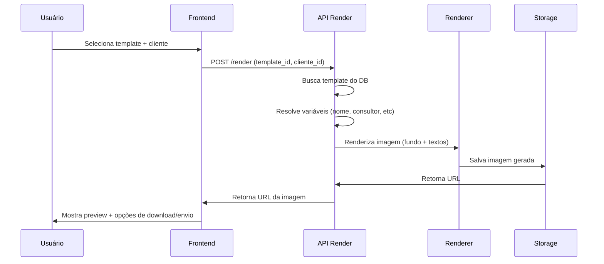

# Guia de Implementação - Novo Sistema de Templates

## Resumo das Mudanças

### Antes (Sistema Atual)
- Templates de texto com temas SVG/PNG estáticos
- Biblioteca fixa de temas oficiais
- Templates definidos em código (`officialLibrary.ts`)

### Depois (Novo Sistema)
- Templates visuais 1080x1080px com áreas VAZIAS
- Preenchimento automático de texto pelo sistema
- Hierarquia: Admin > Master > Gestor > Usuário
- Upload de templates personalizados por cada nível

## Passos de Implementação

### 1. Aplicar Migration

```bash
# Aplicar a migration no Supabase
supabase db push

# Ou via SQL Editor no dashboard do Supabase
-- Copiar conteúdo de: database/migrations/20260324_templates_hierarquia_v2.sql
```

### 2. Limpar Sistema Antigo

#### 2.1 Remover biblioteca oficial atual
O arquivo `src/lib/cards/officialLibrary.ts` pode ser mantido temporariamente para referência, mas os templates serão movidos para o banco de dados.

#### 2.2 Atualizar componentes
Os componentes atuais que usam `OFFICIAL_CARD_THEMES` e `OFFICIAL_CARD_TEMPLATES` precisam ser atualizados para buscar do banco via API.

### 3. Criar APIs

#### 3.1 API de Listagem de Templates
```typescript
// src/pages/api/v1/templates/index.ts
// GET /api/v1/templates?categoria=aniversario
// Retorna templates visíveis para o usuário logado (hierarquia)
```

#### 3.2 API de Upload de Template (Admin/Master/Gestor)
```typescript
// src/pages/api/v1/templates/upload.ts
// POST /api/v1/templates/upload
// Upload da imagem de fundo + metadados do template
```

#### 3.3 API de Renderização
```typescript
// src/pages/api/v1/cards/render.ts
// POST /api/v1/cards/render
// Recebe template_id + variáveis, retorna imagem renderizada
```

### 4. Estrutura de Storage

```
Storage Bucket: "templates-v2"
├── system/           # Templates do admin (acessível a todos)
│   └── aniversario-baloes-viagem.png
├── companies/
│   └── {company_id}/
│       └── templates/
│           └── natal-empresa.png
├── teams/
│   └── {team_id}/
│       └── templates/
│           └── aniversario-equipe.png
└── users/
    └── {user_id}/
        └── templates/
            └── meu-template.png
```

### 5. Fluxo de Renderização



### 6. Componentes a Criar/Atualizar

#### 6.1 Novo Componente: `TemplateGallery`
- Lista templates em grade (categorias)
- Filtros por ocasião
- Indicador de escopo (sistema, empresa, equipe, pessoal)

#### 6.2 Novo Componente: `TemplateUploader`
- Upload de imagem 1080x1080
- Preview com grid de áreas
- Definição de categoria/ocasião
- Seleção de escopo (quem pode ver)

#### 6.3 Novo Componente: `CardRenderer`
- Seleção de template
- Input de variáveis (nome cliente, mensagem personalizada)
- Preview em tempo real
- Download/Envio

#### 6.4 Componente a Atualizar: `ClientesIsland`
- Adicionar botão "Enviar Mensagem" nas ações do cliente
- Abrir modal com `CardRenderer`

### 7. Dados Iniciais (Seed)

Após aplicar a migration, os seguintes dados já estarão disponíveis:

1. **Tema**: `aniversario-baloes-viagem` (placeholder)
   - Categoria: `aniversario`
   - Scope: `system`
   - Status: Ativo, Default

2. **Template**: `feliz-aniversario`
   - Título: "Feliz Aniversário!"
   - Corpo: Mensagem padrão de aniversário
   - Referência ao tema acima

> ⚠️ **IMPORTANTE**: O asset da imagem precisa ser criado pelo designer e enviado para o storage antes de ficar disponível!

### 8. Checklist de Lançamento

#### Backend
- [ ] Migration aplicada no Supabase
- [ ] RLS policies ativas
- [ ] Storage bucket "templates-v2" criado
- [ ] API de listagem funcionando
- [ ] API de upload funcionando
- [ ] API de renderização funcionando

#### Frontend
- [ ] Componente `TemplateGallery` criado
- [ ] Componente `TemplateUploader` criado
- [ ] Componente `CardRenderer` criado
- [ ] Integração com página de clientes

#### Assets
- [ ] Template de Aniversário criado pelo designer
- [ ] Imagem enviada para storage
- [ ] URL do asset atualizada no banco

#### Testes
- [ ] Admin consegue fazer upload
- [ ] Master vê templates do admin + próprios
- [ ] Gestor vê templates do master + próprios
- [ ] Vendedor vê todos os templates acima + próprios
- [ ] Renderização funciona corretamente
- [ ] Download da imagem funciona

### 9. Migração de Dados (Opcional)

Se desejar migrar templates antigos:

```sql
-- Exemplo: migrar templates existentes para nova estrutura
-- (apenas os personalizados, não os oficiais)

INSERT INTO message_templates_v2 (
  created_by,
  scope,
  company_id,
  nome,
  slug,
  categoria,
  assunto,
  titulo,
  corpo,
  ativo
)
SELECT 
  user_id,
  CASE 
    WHEN user_type = 'admin' THEN 'system'
    WHEN user_type = 'master' THEN 'company'
    ELSE 'user'
  END,
  company_id,
  nome,
  slugify(nome),
  categoria,
  assunto,
  titulo,
  corpo,
  ativo
FROM templates_antigos;
```

### 10. Variáveis Suportadas

As seguintes variáveis podem ser usadas nos templates:

| Variável | Descrição | Exemplo |
|----------|-----------|---------|
| `{{primeiro_nome}}` | Primeiro nome do cliente | "João" |
| `{{nome_completo}}` | Nome completo do cliente | "João Silva" |
| `{{consultor}}` | Nome do consultor | "Maria Santos" |
| `{{cargo_consultor}}` | Cargo do consultor | "Consultora de Viagens" |
| `{{empresa}}` | Nome da empresa | "CVC Viagens" |
| `{{data_viagem}}` | Data da viagem | "15/12/2026" |
| `{{destino}}` | Destino da viagem | "Paris" |
| `{{mensagem}}` | Mensagem personalizada | Texto livre |

## Próximos Passos

1. **Designer cria template de Aniversário**
   - Seguir briefing em: `docs/TEMPLATE_ANIVERSARIO_BRIEFING_DESIGNER.md`

2. **Desenvolvedor implementa APIs**
   - Criar endpoints de listagem, upload e render

3. **Testar hierarquia**
   - Verificar permissões de cada perfil

4. **Criar mais templates**
   - Natal, Ano Novo, Páscoa, etc.

## Documentação Relacionada

- `TEMPLATES_SISTEMA_ESPECIFICACAO.md` - Especificação técnica completa
- `TEMPLATE_ANIVERSARIO_BRIEFING_DESIGNER.md` - Briefing para designer
- `database/migrations/20260324_templates_hierarquia_v2.sql` - Migration SQL
